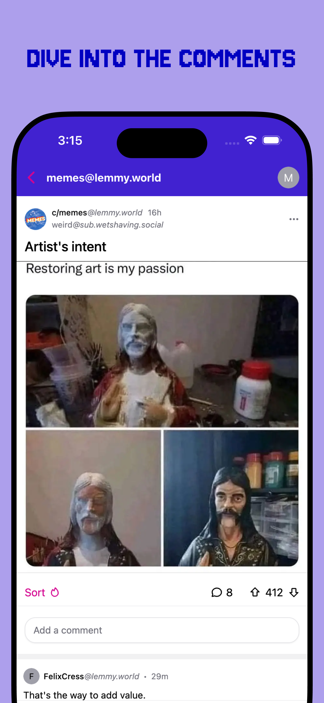
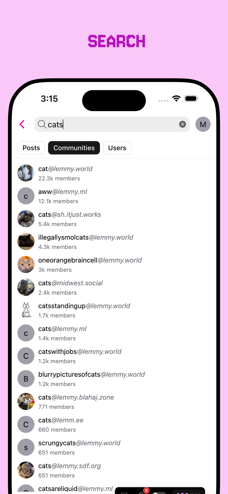
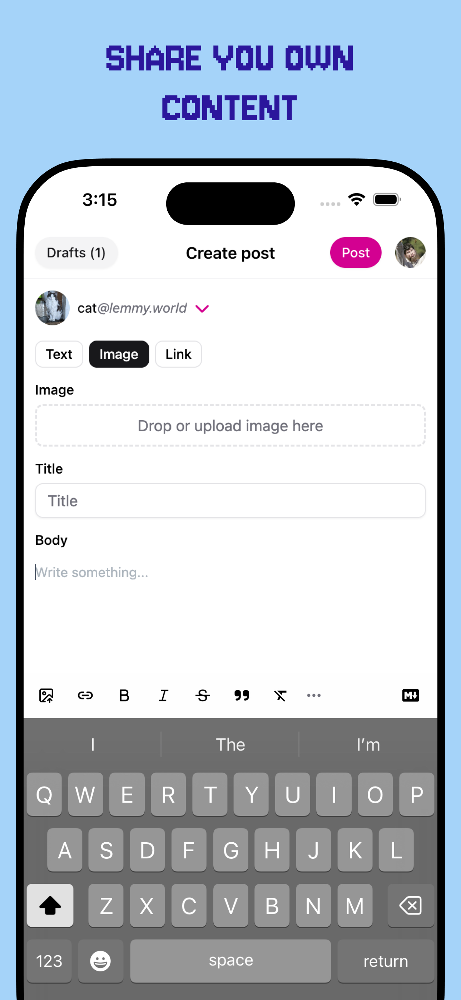

<p align="center">
  <a href="https://blorpblorp.xyz/" target="_blank" rel="noopener noreferrer">
    
  </a>
  <h1 align="center">Blorp</h1>
</p>

<p align="center">
<a href="https://blorpblorp.xyz/" target="_blank" rel="noopener noreferrer">Web App</a> · <a href="https://github.com/christianjuth/blorp/issues/new?assignees=&labels=bug&projects=&template=bug_report.md&title=">Report Bug</a> · <a href="https://github.com/christianjuth/blorp/issues/new?assignees=&labels=enhancement&projects=&template=feature_request.md&title=">Request Feature</a> · <a href="https://github.com/christianjuth/blorp/releases">Releases</a>
</p>

<p align="center">
&nbsp;<a href="https://apps.apple.com/us/app/blorp-for-lemmy/id6739925430"></a>&nbsp;
&nbsp;<a href="https://play.google.com/store/apps/details?id=xyz.blorpblorp.app"></a>&nbsp;
</p>
<p align="center">
  <a href="https://matrix.to/#/#blorp:matrix.org"></a>
</p>
<br/>

<p align="center">
 &nbsp;&nbsp;
 &nbsp;&nbsp;
 &nbsp;&nbsp;
 &nbsp;&nbsp;
 &nbsp;&nbsp;
</p>
<br/>

## Try it!
| Url | Description |
|-----|-----|
| [blorpblorp.xyz](https://blorpblorp.xyz/) | ✅  Official site updated multiple times a week |
| [blorp.lemmy.zip](https://blorp.lemmy.zip) | Blorp hosted by the lemmy.zip team |
| [blorp.piefed.zip](https://blorp.piefed.zip) | Blorp hosted by the piefed.zip team |
| [b.feddit.uk](https://b.feddit.uk) | Blorp hosted by the feddit.uk team |
| [blorp.europe.pub](https://blorp.europe.pub) | Hosted by europe.pub | |

## 🚀 Download

* [iOS](https://apps.apple.com/us/app/blorp-for-lemmy/id6739925430)
* [macOS](https://github.com/christianjuth/blorp/releases/latest)
* [Android](https://play.google.com/store/apps/details?id=xyz.blorpblorp.app)

## 🧪 Beta Testing

* [Join iOS TestFlight Beta](https://testflight.apple.com/join/T2pYyShr)
* [Join Google Play Beta](https://play.google.com/apps/testing/xyz.blorpblorp.app)

## 🐳 Self host via Docker

```bash
# pull the latest Blorp image
docker pull christianjuth/blorp:latest

# run it on port 8080 (host → container), passing any runtime env‑vars you need
docker run -d \
  --name blorp \
  -p 8080:80 \
  -e REACT_APP_DEFAULT_INSTANCE="https://lemmy.zip" \
  -e REACT_APP_NAME="Blorp" \
  -e REACT_APP_LOCK_TO_DEFAULT_INSTANCE="false" \
  christianjuth/blorp:latest
```

## 💬 Blorp Community

Want to ask questions, share feedback, or just chat with other Blorp users? Head over to our community at  
[lemmy.ml/c/blorp](https://lemmy.ml/c/blorp).

## 📚 Stack

* [React](https://react.dev/) – The library for web and native user interfaces
* [Ionic/Capacitor](https://ionicframework.com/docs/) – An open source UI toolkit for building performant, high-quality mobile apps using web technologies
* [Tauri](https://tauri.app/) – Create small, fast, secure, cross-platform applications
* [Vite](https://vite.dev/) – Next Generation Frontend Tooling
* [Zustand](https://github.com/pmndrs/zustand/) – Bear necessities for state management in React
* [TanStack Query](https://tanstack.com/query/docs) – Powerful asynchronous state management for TS/JS, React, Solid, Vue, Svelte and Angular
* [TanStack Virtual](https://tanstack.com/virtual/latest) – Headless UI for Virtualizing Large Element Lists

## ❤️ Special thanks to 

* Voyager. I settled on a stack that is pretty similar to [Voyager](https://github.com/aeharding/voyager). There are a bunch of problems that Voyager had already solved that I was able to solve very quickly by looking at their codebase. Special thanks to [aeharding](https://github.com/aeharding) for answering many of my questions. I also regularly test Blorp against Voyager to ensure I deliver the quality of app that Blorp users deserve.
* The PieFed team for their support and quickly resolving any and all feedback I brought them.

## 📄 License

* [AGPL-3.0](https://github.com/christianjuth/blorp/blob/main/LICENSE) © Blorp
* You can also view all the [licenses of the libraries we ship](https://github.com/christianjuth/blorp/blob/main/THIRD-PARTY-NOTICES.md) in our app
